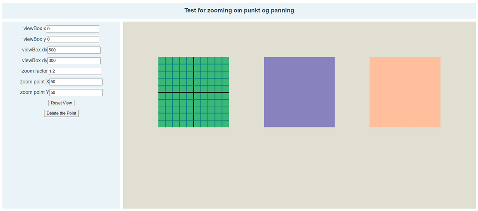

# svg-zoom-test

### A vue.js (2) test-project for zooming and panning a SVG workspace

* Currently only for mouse/trackpad - no touchscreen support as of yet
* Zoom; mouse-wheel-scroll to and from the cursor location
* Pan with mouse; hold down middle mouse-button and drag the SVG around
* Pan with laptop touchpad; hold down the ALT-key and left-button and drag the SVG around
* Left-click to add a point to the SVG 
* Drag the point by grabbing it and moving it around
* Simplified store pattern (not vuex) with direct mutations for quick development...
* Visible and, to an extent, editable Viewbox and zoom-variables
* CSS Grid for layout

### Credits and inspiration
* Zoom, Pan: https://codepen.io/osublake/pen/oGoyYb
* Dragging SVG-elements: https://www.petercollingridge.co.uk/tutorials/svg/interactive/dragging/



### Link
https://kraftanlegget.no/svg-zoom-test/dist/#/

## Project setup
```
npm install
```

### Compiles and hot-reloads for development
```
npm run serve
```

### Compiles and minifies for production
```
npm run build
```

### Lints and fixes files
```
npm run lint
```

### Customize configuration
See [Configuration Reference](https://cli.vuejs.org/config/).
